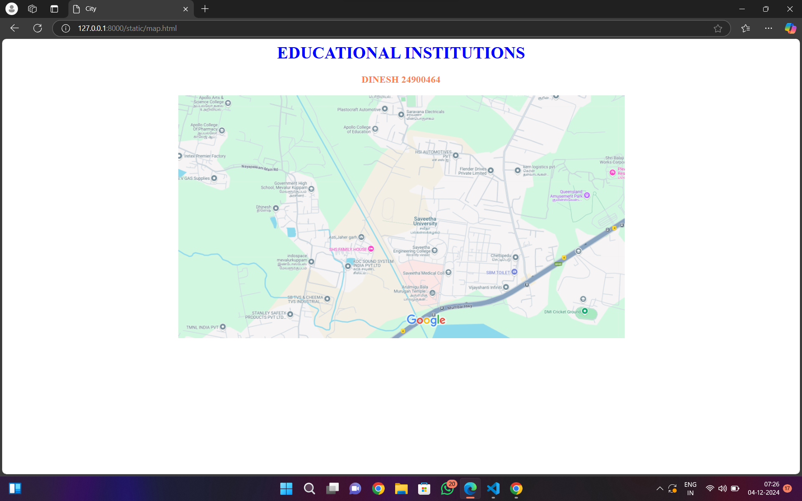

# Ex04 Places Around Me
## Date: 4-12-2024

## AIM
To develop a website to display details about the places around my house.

## DESIGN STEPS

### STEP 1
Create a Django admin interface.

### STEP 2
Download your city map from Google.

### STEP 3
Using ```<map>``` tag name the map.

### STEP 4
Create clickable regions in the image using ```<area>``` tag.

### STEP 5
Write HTML programs for all the regions identified.

### STEP 6
Execute the programs and publish them.

## CODE

```
map.html

<html>
<head>
<title>City</title>
</head>
<body>
<h1 align="center">
<font color="blue"><b>EDUCATIONAL INSTITUTIONS</b></font>
</h1>
<h3 align="center">
<font color="coral"><b>DINESH 24900464</b></font>
</h3>
<center>
    

    <map name="image-map">
        <area target="" alt="saveetha" title="saveetha" href="saveetha.html" coords="395,229,584,324" shape="rect">
        <area target="" alt="arts" title="arts" href="arts.html" coords="27,0,127,50" shape="rect">
        <area target="" alt="apollo" title="apollo" href="apollo.html" coords="282,31,421,97" shape="rect">
        <area target="" alt="queensland" title="queensland" href="queensland.html" coords="683,131,813,233" shape="rect">
        <area target="" alt="school" title="school" href="school.html" coords="131,130,265,212" shape="rect">
    </map>
</center>
</body>
</html>


apollo.html

<html>
<head>
<title>EDUCATIONAL INSTITUTIONS</title>
</head>
<body bgcolor="green">
<h1 align="center">
</h1>
<h3 align="center">
<font color="blue"><b>apollo</b></font>    
</h3>
<hr size="3" color="blue">
<p align="justify">
<front face="Georgia" size="S">
    Apollo College in Chennai, particularly known for its various branches such as Apollo College of Nursing and Apollo Engineering College, has established itself as a prominent educational institution in the region. Each of these colleges offers specialized programs aimed at equipping students with the necessary skills and knowledge to excel in their respective fields.

    ** Apollo College of Nursing
    
    Overview: Apollo College of Nursing is dedicated to providing high-quality nursing education. It focuses on developing competent nursing professionals who can meet the healthcare needs of society.
    
    Programs Offered: The college offers various nursing programs, including B.Sc. Nursing, Post Basic B.Sc. Nursing, and M.Sc. Nursing. These programs are designed to provide both theoretical knowledge and practical experience.
    
    Facilities: The college is equipped with modern facilities, including well-equipped laboratories, a library with a vast collection of resources, and simulation labs that enhance the learning experience.
    
    Clinical Exposure: Students gain hands-on experience through clinical training in affiliated hospitals, which is crucial for their professional development.
    
    Apollo Engineering College
    
    Overview: Apollo Engineering College is known for its commitment to excellence in engineering education. It aims to foster innovation and technical skills among its students.
    
    Programs Offered: The college offers undergraduate and postgraduate programs in various engineering disciplines, including Computer Science, Mechanical, Civil, and Electrical Engineering.
    
    Infrastructure: The college boasts state-of-the-art infrastructure, including modern classrooms, laboratories, and workshops that facilitate practical learning.
    
    Research Opportunities: Apollo Engineering College encourages research and development, providing students with opportunities to engage in projects and collaborate with industry professionals.
    
    Cultural and Extracurricular Activities
    
    Events and Celebrations: Apollo College hosts various events throughout the year, such as Women's Day celebrations, sports days, and cultural festivals like Pongal and Christmas. These events promote a sense of community and enhance the overall student experience.
    
    Student Engagement: The colleges encourage student participation in extracurricular activities, which play a vital role in developing leadership skills and teamwork.
    
    Placement Opportunities: Both Apollo College of Nursing and Apollo Engineering College have robust placement cells that assist students in securing internships and job placements. They organize placement drives and workshops to prepare students for the job market.
    
    Community and Social Responsibility
    
    Outreach Programs: Apollo College is actively involved in community service and outreach programs. These initiatives aim to instill a sense of social responsibility among students and encourage them to contribute positively to society.
    
    Health Camps: The nursing college often organizes health camps in rural areas, providing essential healthcare services and raising awareness about health issues.

 </font>
 </p>      
</body>
</html>

arts.html

<html>
<head>
<title>EDUCATIONAL INSTITUTIONS</title>
</head>
<body bgcolor="purple">
<h1 align="center">
</h1>
<h3 align="center">
<font color="blue"><b>ARTS</b></font>    
</h3>
<hr size="3" color="blue">
<p align="justify">
<front face="Georgia" size="S">
    The Arts Block, often a central feature of universities and colleges, is a dedicated space that embodies the essence of creative expression, academic inquiry, and cultural engagement. Typically housing a variety of disciplines such as literature, history, philosophy, visual arts, performing arts, and social sciences, the Arts Block serves as a vibrant hub for students, faculty, and the community.

    Architectural Design and Environment
    The architectural design of an Arts Block is often reflective of its purpose. Many Arts Blocks feature open, airy spaces filled with natural light, fostering an atmosphere conducive to creativity and collaboration. Classrooms and studios are equipped with the latest technology and resources, including art supplies, performance spaces, and multimedia facilities. This thoughtful design encourages students to engage with their subjects in a hands-on manner, whether through painting, theater, or interdisciplinary projects.
    
    Academic Programs and Opportunities
    The Arts Block typically offers a diverse range of academic programs. Students can pursue degrees in various fields, including fine arts, graphic design, music, theater, literature, and cultural studies. These programs often emphasize critical thinking, creativity, and communication skills, preparing students for a wide array of careers.
    
    In addition to traditional coursework, the Arts Block frequently hosts workshops, guest lectures, and masterclasses led by industry professionals and visiting artists. These events provide students with invaluable insights into their fields and opportunities for networking, collaboration, and mentorship.
    
    Community Engagement and Cultural Events
    One of the defining features of the Arts Block is its commitment to community engagement. Many Arts Blocks serve as venues for cultural events, exhibitions, and performances that invite the broader community to participate in the arts. This may include art exhibitions showcasing student and faculty work, theater productions, music concerts, and film screenings.
    
    These events not only enrich the cultural landscape of the institution but also foster a sense of belonging and connection among students, faculty, and local residents. They create opportunities for dialogue and exchange of ideas, highlighting the importance of the arts in society.
    
    Support for Emerging Artists
    The Arts Block often provides essential support for emerging artists through various initiatives. This may include access to galleries for exhibitions, performance spaces for rehearsals and shows, and funding opportunities for projects. Many institutions also have arts councils or student organizations that advocate for the arts and provide resources for students to develop their work.
    
    Interdisciplinary Collaboration
    An essential aspect of the Arts Block is its promotion of interdisciplinary collaboration. The arts often intersect with other fields, such as technology, science, and social justice. The Arts Block serves as a space where students from different disciplines can come together to explore these intersections, fostering innovation and creativity. Collaborative projects may result in unique performances, installations, or research that challenge conventional boundaries.
 </font>
 </p>      
</body>
</html>


queensland.html

<html>
<head>
<title>ENTERTAINMENT</title>
</head>
<body bgcolor="GREEN">
<h1 align="center">
</h1>
<h3 align="center">
<font color="blue"><b>QUEENSLAND</b></font>    
</h3>
<hr size="3" color="blue">
<p align="justify">
<front face="Georgia" size="S">
    Queens Land, also known as Queensland Amusement Park, is a prominent theme park located in Poonamallee, Chennai, India. Established in 2003, it has become a favorite destination for families and thrill-seekers alike, offering a wide range of rides and attractions that cater to visitors of all ages. Spanning over 70 acres, the park is situated conveniently along the Chennai-Bangalore Trunk Road, making it easily accessible for both locals and tourists.

    Attractions and Rides
    Queens Land is renowned for its diverse array of rides, boasting a total of 51 attractions. Among these, 33 are designed for adults, while 18 are specifically tailored for children. The park features a mix of thrill rides, family-friendly attractions, and water rides, ensuring that there is something for everyone. Some of the standout attractions include the Free Fall Tower, which offers an exhilarating drop experience, and Super Waves, a popular water ride that provides refreshing fun, especially during the hot summer months.
    
    The park also includes a variety of kiddie rides, gentle attractions, and interactive games, making it an ideal spot for families with young children. In addition to the rides, Queens Land features spacious picnic areas, food stalls, and shops that sell souvenirs, providing visitors with a complete day-out experience.
    
    Safety Measures and Incidents
    While Queens Land has garnered a reputation for fun and excitement, it has also faced scrutiny regarding safety. In 2008, a tragic incident occurred when an 11-year-old girl lost her life due to a collision on a water ride. This incident led to significant media coverage and prompted the authorities to take action, resulting in the arrest of several employees. The park was temporarily closed for investigations and safety evaluations.
    
    In June 2019, another safety incident occurred when the cables of the Free Fall Tower snapped, causing a fall of approximately 10 feet. Fortunately, while 12 individuals were injured, there were no serious injuries reported. Following this incident, the park was ordered to close indefinitely for thorough safety assessments and improvements. These events highlight the importance of safety in amusement parks and have led to increased scrutiny of operational protocols.
    
    Visitor Experience
    Despite the challenges, Queens Land remains a vibrant and exciting venue for entertainment. The park attracts a diverse crowd, from families enjoying a day out to teenagers seeking thrills. The atmosphere is lively, with the sounds of laughter and excitement echoing throughout the park. Many visitors appreciate the variety of attractions, which allows them to spend an entire day exploring and enjoying the rides.
    
    Queens Land also hosts special events and promotions throughout the year, making it a popular choice for birthday parties, school outings, and group events. The staff is generally friendly and attentive, contributing to a positive visitor experience.
    
    Conclusion
    In summary, Queens Land in Chennai is a significant amusement park that offers a blend of thrill, adventure, and family-friendly fun. With its diverse range of attractions, it serves as a major entertainment hub in the region. While safety incidents have raised concerns, the park continues to attract visitors eager for an exciting day out. With ongoing improvements and a commitment to safety, Queens Land aims to maintain its status as a beloved destination for both locals and tourists, ensuring that it remains a place where fun and adventure come together in a vibrant setting.  
 </font>
 </p>      
</body>
</html>


saveetha.html
<html>
<head>
<title>My Home Town</title>
</head>
<body bgcolor="red">
<h1 align="center">
</h1>
<h3 align="center">
<font color="blue"><b>SAVEETHA</b></font>    
</h3>
<hr size="3" color="blue">
<p align="justify">
<front face="Georgia" size="S">
    Saveetha Engineering College (SEC) is a prominent institution located in Chennai, Tamil Nadu, India. Established in 2001, the college is part of the Saveetha Group of Institutions, which includes a medical college, a dental college, and various other educational ventures. SEC has gained recognition for its commitment to providing quality education in engineering and technology, making it a sought-after destination for aspiring engineers.

The college is affiliated with Anna University, which is one of the leading technical universities in India. This affiliation ensures that the curriculum is aligned with industry standards and incorporates the latest advancements in technology. SEC offers a wide range of undergraduate and postgraduate programs in various engineering disciplines, including Computer Science, Electronics and Communication, Mechanical, Civil, and Electrical Engineering, among others. The programs are designed to equip students with both theoretical knowledge and practical skills, preparing them for the competitive job market.

One of the key strengths of Saveetha Engineering College is its emphasis on research and innovation. The institution encourages students and faculty to engage in research projects, fostering a culture of inquiry and creativity. SEC has established various research centers and collaborations with industries, which provide students with opportunities to work on real-world problems and gain hands-on experience. This focus on research not only enhances the learning experience but also contributes to the development of new technologies and solutions.

In addition to its academic programs, SEC places a strong emphasis on extracurricular activities and holistic development. The college has a vibrant campus life, with numerous clubs and organizations that cater to a wide range of interests, including technical clubs, cultural associations, and sports teams. These activities encourage students to develop leadership skills, teamwork, and a sense of community, which are essential for personal and professional growth.

The infrastructure at Saveetha Engineering College is modern and well-equipped, featuring state-of-the-art laboratories, libraries, and classrooms. The college also provides facilities for sports and recreation, ensuring that students have a balanced and enriching college experience. The campus is designed to promote a conducive learning environment, with ample resources available to support students in their academic pursuits.

SEC is also known for its strong placement record. The college has a dedicated placement cell that works tirelessly to connect students with potential employers. Through various training programs, workshops, and industry interactions, students are prepared for interviews and job placements. Many reputable companies visit the campus for recruitment, offering a range of job opportunities to graduates.

Community engagement and social responsibility are integral to the ethos of Saveetha Engineering College. The institution encourages students to participate in community service initiatives and outreach programs, fostering a sense of responsibility towards society. This commitment to social causes not only enhances the students' educational experience but also instills values of empathy and service.

In conclusion, Saveetha Engineering College stands out as a leading engineering institution in Tamil Nadu, known for its academic excellence, research initiatives, and holistic development approach. With its strong industry connections, modern infrastructure, and commitment to student success, SEC continues to shape the future of engineering education and empower the next generation of engineers.
 </font>
 </p>      
</body>
</html>


school.html

<html>
<head>
<title>EDUCATIONAL INSTITUTIONS</title>
</head>
<body bgcolor="yellow">
<h1 align="center">
</h1>
<h3 align="center">
<font color="blue"><b>SCHOOLS</b></font>    
</h3>
<hr size="3" color="blue">
<p align="justify">
<front face="Georgia" size="S">
    Chennai, the capital city of Tamil Nadu, is known for its rich cultural heritage, vibrant economy, and educational institutions. The city boasts a diverse range of schools that cater to various educational philosophies, curricula, and age groups. From traditional schools with a long-standing legacy to modern institutions that emphasize innovative teaching methods, Chennai offers a plethora of options for parents seeking quality education for their children.

    Types of Schools
    Chennai's schools can be broadly categorized into several types, including government schools, private schools, international schools, and alternative education institutions. Government schools, funded by the state, provide affordable education and often follow the Tamil Nadu State Board curriculum. These schools aim to make education accessible to all, although they may vary in terms of infrastructure and resources.
    
    Private schools, on the other hand, are prevalent throughout the city and often offer better facilities and extracurricular activities. Many private institutions in Chennai follow the Central Board of Secondary Education (CBSE) or the Council for the Indian School Certificate Examinations (CISCE) curricula, which are recognized nationwide. These schools often emphasize academic excellence and holistic development, providing a range of extracurricular activities, sports, and cultural programs.
    
    International schools have also gained popularity in Chennai, catering to expatriates and Indian families seeking a global education. These schools typically follow international curricula such as the International Baccalaureate (IB) or the Cambridge International Examinations (CIE). They focus on developing critical thinking, creativity, and global awareness among students, preparing them for higher education opportunities abroad.
    
    Additionally, alternative education institutions, such as Montessori and Waldorf schools, provide unique educational approaches that prioritize experiential learning and individual development. These schools often emphasize a child-centered approach, fostering creativity and independence in students.
    
    Academic Excellence
    Chennai's schools are known for their commitment to academic excellence. Many institutions have produced top-performing students in national and state-level examinations, contributing to the city's reputation as an educational hub. Schools often employ qualified and experienced teachers who are dedicated to nurturing students' intellectual and personal growth.
    
    Extracurricular activities play a crucial role in the educational experience in Chennai. Schools encourage participation in sports, arts, music, and cultural events, recognizing the importance of a well-rounded education. Annual day celebrations, sports days, and inter-school competitions are common, fostering teamwork and leadership skills among students.
    
    Infrastructure and Facilities
    The infrastructure of schools in Chennai varies widely, with many private institutions investing significantly in modern facilities. Well-equipped classrooms, libraries, laboratories, and sports facilities are common in many schools, enhancing the learning experience. Some schools also offer advanced technology integration, such as smart classrooms and digital learning tools, to facilitate interactive learning.
    
    Challenges and Opportunities
    Despite the strengths of Chennai's educational landscape, challenges remain. Issues such as overcrowded classrooms, disparities in educational quality between government and private schools, and the pressure of competitive examinations can impact students' learning experiences. However, initiatives by the government and non-profit organizations aim to address these challenges by improving infrastructure and teacher training in government schools.
    
    Conclusion
    In conclusion, Chennai is home to a diverse array of schools that cater to the educational needs of its population. The city’s commitment to academic excellence, coupled with a focus on holistic development, makes it a significant center for education in India. As the educational landscape continues to evolve, Chennai's schools are likely to adapt and innovate, ensuring that they provide quality education that prepares students for the challenges of the future. With a blend of traditional values and modern educational practices, Chennai remains a promising destination for families seeking quality education for their children.  
 </font>
 </p>      
</body>
</html>

```


## OUTPUT




## RESULT
The program for implementing image maps using HTML is executed successfully.
